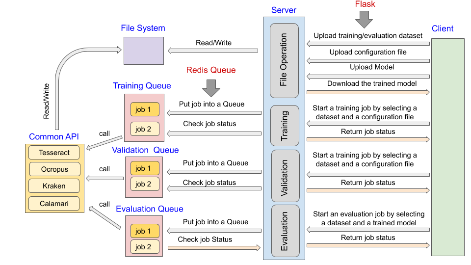

# OCRD
A repository for online OCRD training infrastructure.

## Setup

```sh
sudo apt-get install redis
pip install -r requirements.txt
```

### Installation of the Engines
The instructions for installing the engines (Tesseract, kraken, OCRopus, Calamari) are in the folder [install](https://github.com/Doreenruirui/okralact/tree/master/install).

### Installaton of the Training System
```
$ wget https://github.com/Doreenruirui/okralact/archive/master.zip
```

### Deploy the system on a server

Coming soon.

## System Structure

<center>
     
</center>

**Okralact** is both a set of specifications and a prototype implementation for harmonizing the input data, parameterization and provenance tracking of training different OCR engines. It is a client/server architecture application. The interactions between the client nodes and the server are implementeqd using **Flask**, a lightweight web application framework for Python. All the training or evaluation jobs submitted to the server are handled in the background by task queues implemented wth **Redis Queue** (**RQ**).  

The folder *app* contains the code for the web-application and task queues. The folder *app/templates* defined a set of web interfaces that the users directly interacted with.  Through these webpages, the user can 

 *	upload 
   	*	a dataset
   	*	a configuration file for training a specific engine
 *	submit 
   	*	a job for training an OCR model by selecting a uploaded model and a configuration file
   	*	a job for generating the report of validating all the intermediately models saved during training (can be used to pick the best model)
   	*	a job for evaluating a trained model by selecting a evaluation dataset

The file *app/route.py* contains the code for handling the users' HTTP requests and responses with Flask,  and the code for processing the users' jobs with Redis Queue. There are three task queues running in the backend,  i.e., the training queue, the validation queue and the evaluation queue. Each type of job submitted by the user would be put into its corresponding task queue, where it will wait to be excuted. 

When a job gets opportunity to run, it will call the common API for training, validation or evaluation defined in the folder *engines*. The jobs in training task queue, validating task queue and evaluating task queue will call the API defined in the file *train.py*, *valid.py* and *eval.py* respectively. 

 The unifie specifications for all the OCR engines are defined in the folder *engines/schemas* with **jsonschema**.  It contains  the following files:

* *common.schema* , defines a set of unifed parameters for each engine. 

*  *engine_[engine name].schema*, defines the parameter set for each engine. 

*  *engines/schemas/models*, contains the schemas for the neural network structure for all the engines:

  *  *model_[engine name].schema*,  define the neural network layers, e.g., input, cnn, pooling, dropout, rnn, output allowed by each engine.
  *  *layer_all_[engine name].schema*, define the parameters allowed in each layer by each engine. 
  * *layer_[layer name].schema*, defines the set of parameters allowed by each neural network layer. 

* *translate.json*,  defines the mapping of the unified parameters to the engine-specific parameters.

*  *validating parameters.py*,  validate whether the configuration file that the users uploaded are valid.

*  *translate_parameters.py*,  translate the user-specific configuration files into the original set parameters that can recognized by each engine.  

*  *translate_model.py*, translate the unified definition of neural network structures to the engine -specific model structure definition language.

* *process_tesseract.py*, define the steps to  preprocess the data fo tesseract.

  

  

  

